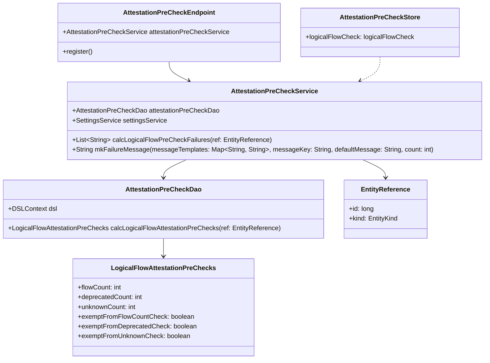

```mermaid
classDiagram
    class AttestationPreCheckService {
        +AttestationPreCheckDao attestationPreCheckDao
        +SettingsService settingsService
        +List~String~ calcLogicalFlowPreCheckFailures(ref: EntityReference)
        +String mkFailureMessage(messageTemplates: Map~String, String~, messageKey: String, defaultMessage: String, count: int)
    }

    class AttestationPreCheckEndpoint {
        +AttestationPreCheckService attestationPreCheckService
        +register()
    }

    class AttestationPreCheckDao {
        +DSLContext dsl
        +LogicalFlowAttestationPreChecks calcLogicalFlowAttestationPreChecks(ref: EntityReference)
    }

    class LogicalFlowAttestationPreChecks {
        +flowCount: int
        +deprecatedCount: int
        +unknownCount: int
        +exemptFromFlowCountCheck: boolean
        +exemptFromDeprecatedCheck: boolean
        +exemptFromUnknownCheck: boolean
    }

    class AttestationPreCheckStore {
        +logicalFlowCheck: logicalFlowCheck
    }

    class EntityReference {
        +id: long
        +kind: EntityKind
    }

    AttestationPreCheckService --> AttestationPreCheckDao
    AttestationPreCheckEndpoint --> AttestationPreCheckService
    AttestationPreCheckDao --> LogicalFlowAttestationPreChecks
    AttestationPreCheckStore ..> AttestationPreCheckService
    AttestationPreCheckService --> EntityReference
```
