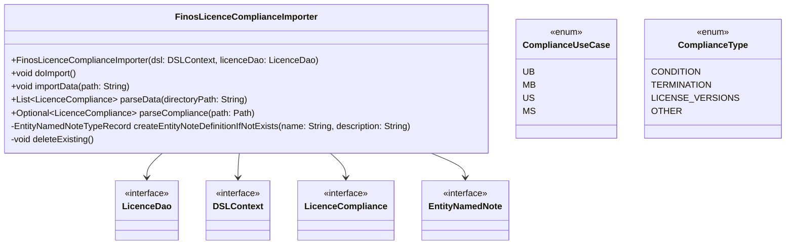

```mermaid
classDiagram

  class FinosLicenceComplianceImporter {
    +FinosLicenceComplianceImporter(dsl: DSLContext, licenceDao: LicenceDao)
    +void doImport()
    +void importData(path: String)
    +List~LicenceCompliance~ parseData(directoryPath: String)
    +Optional~LicenceCompliance~ parseCompliance(path: Path)
    -EntityNamedNoteTypeRecord createEntityNoteDefinitionIfNotExists(name: String, description: String)
    -void deleteExisting()
  }

  class LicenceDao {
    <<interface>>
  }

  class LicenceCompliance {
    <<interface>>
  }

  class EntityNamedNote {
    <<interface>>
  }

  class DSLContext {
    <<interface>>
  }

  class ComplianceUseCase {
    <<enum>>
    UB
    MB
    US
    MS
  }

  class ComplianceType {
    <<enum>>
    CONDITION
    TERMINATION
    LICENSE_VERSIONS
    OTHER
  }

  FinosLicenceComplianceImporter --> LicenceDao
  FinosLicenceComplianceImporter --> DSLContext
  FinosLicenceComplianceImporter --> LicenceCompliance
  FinosLicenceComplianceImporter --> EntityNamedNote
```
