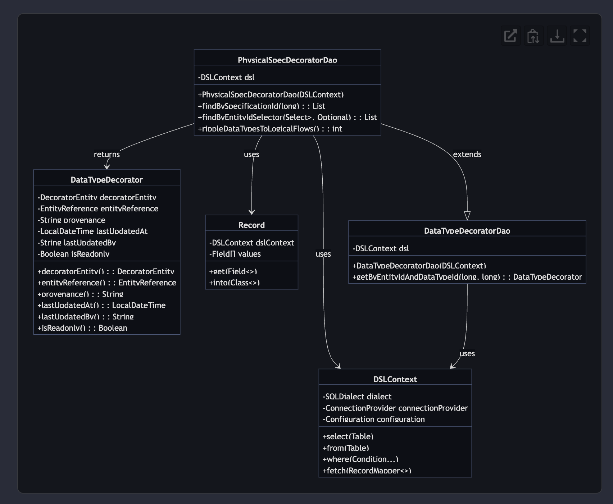
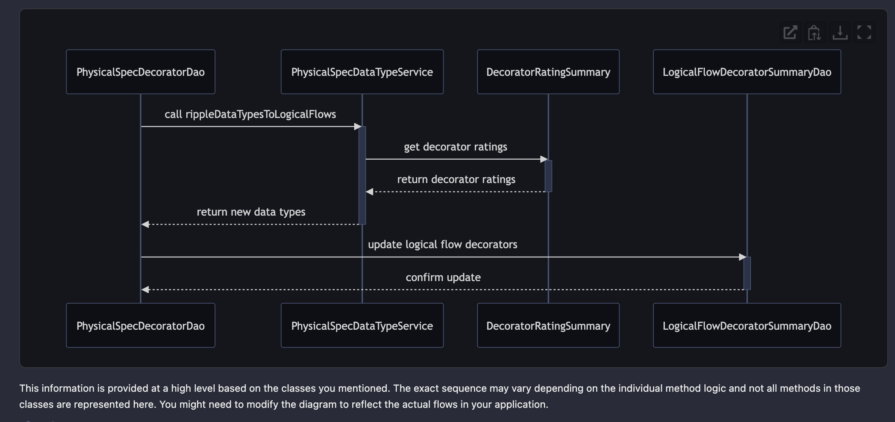
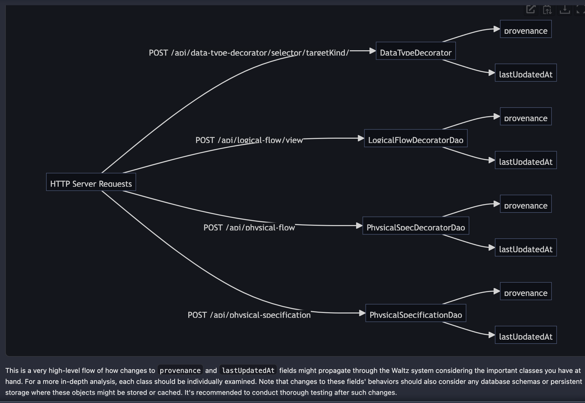
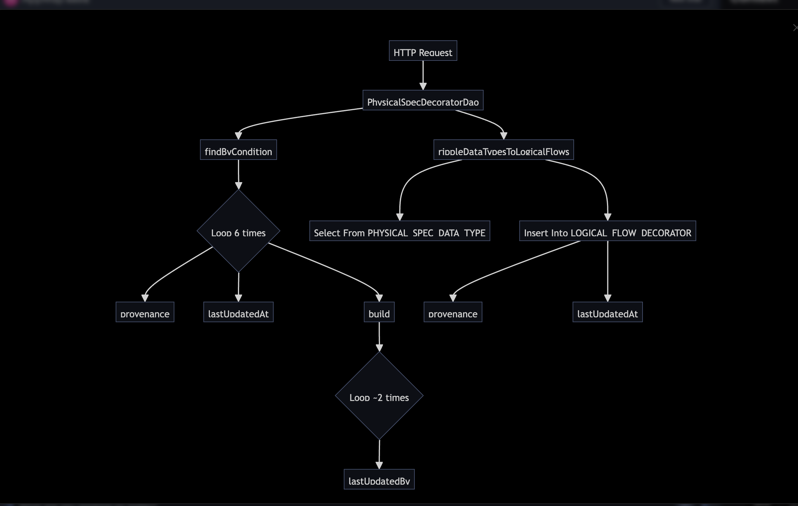
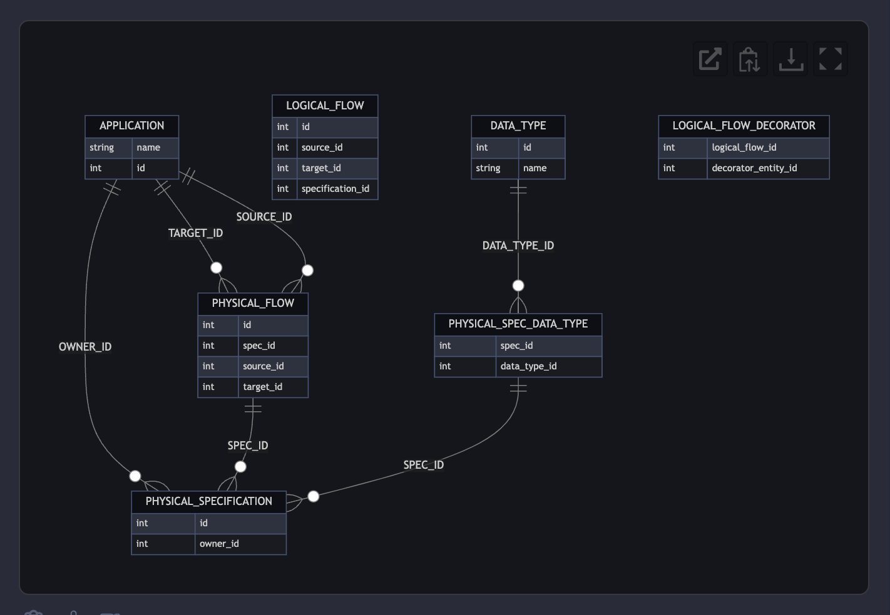

# Diagram Demo

I started by generating a plan for [this issue](https://github.com/finos/waltz/issues/7111) on the Waltz repo.

Key phrases from the response:

*The necessary changes will be made in the PhysicalSpecDecoratorDao class which can be found at the location: waltz-data/src/main/java/org/finos/waltz/data/datatype_decorator/PhysicalSpecDecoratorDao.java.*

Follow-up prompt: What parts of the application do I need to understand in order to make a fix?

*Data Flow in Waltz: A deep knowledge of data flow in the Waltz application would be useful in understanding where else in the application changes might be necessary due to modifies in the provenance and lastUpdatedBy fields.*

---

## Example @diagram prompts based on info gleaned from @plan

@diagram entity relationship diagram for PhysicalSpecDecoratorDao

Refined with these prompts:

1. Please render the above class diagram with the attributes and methods inside DSLContext, DataTypeDecoratorDao, and Record included
2. Please rerender the diagram adding attributes to DataTypeDecoratorDao

@diagram Create a sequence diagram of the related data flows

@diagram create a flow chart to help me understand data flow in Waltz. I want to understand where else in the application changes might be necessary due to modifications in the provenance and lastUpdatedBy fields.

@diagram Can you create a more detailed flow chart for PhysicalSpecDecoratorDao specifically?

@diagram an ERD visualization to help me understand how Waltz maps statitics

***Open question: should we synch the Land of Apps fork of Waltz with the main Waltz repo? If not these issues will fall way out of date.***

